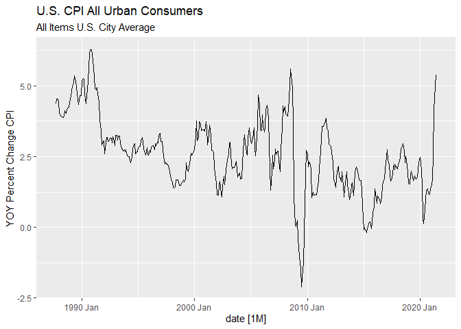
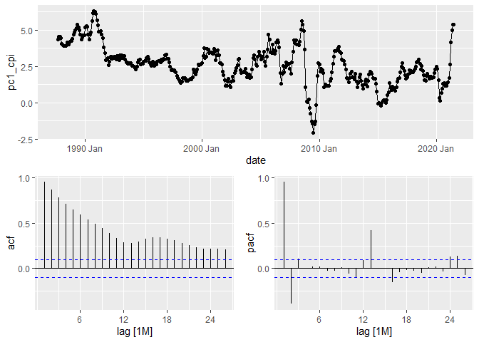
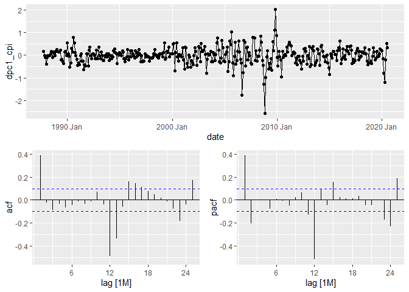
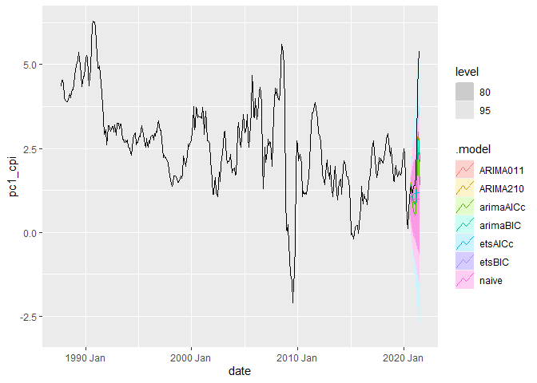
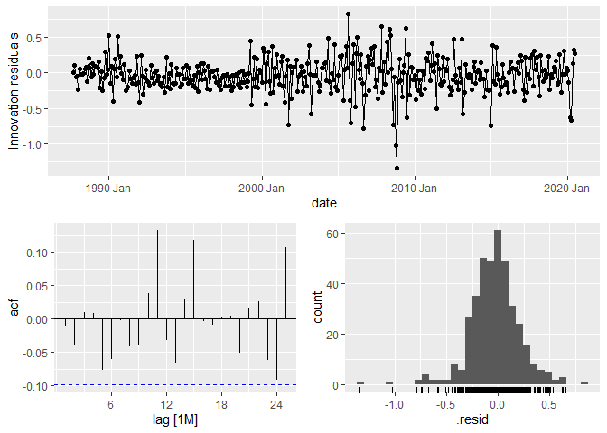
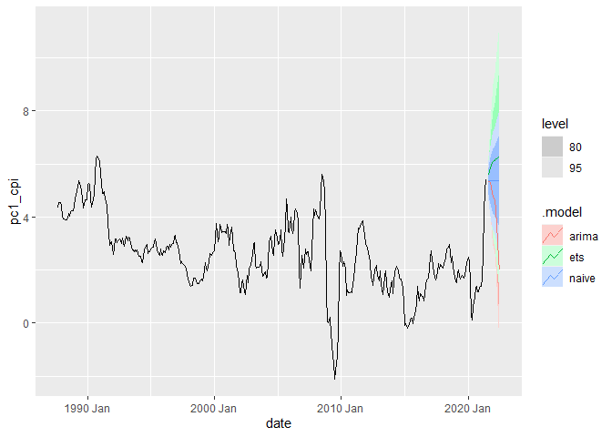

August 2021 Inflation Forecasting
================
Kyle Mouly
September 13, 2021

-   [Setup](#setup)
    -   [Loading Data](#loading-data)
    -   [Stationarity and Seasonality](#stationarity-and-seasonality)
-   [Univariate Models](#univariate-models)
    -   [Model Selection](#model-selection)
    -   [Forecasting](#forecasting)
-   [Official Results](#official-results)

# Setup

For this project I will be forecasting non-seasonally adjusted year over
year CPI for all Urban Consumers for the month of August 2021 (FRED
series id: CPIAUCNS). The data series will be segmented so as to start
after September 1987 to account for the change in the Federal Reserve’s
attitude towards inflation following Paul Volcker’s tenure as chair; a
change which is clear when long term inflation trends are examined. The
loss of data should not be concerning given that there remains over 30
years of monthly data for use in model training.

## Loading Data

``` r
library(tidyverse)
library(fable)
library(fabletools)
library(tsibble)
library(fredr)
library(feasts)
library(lubridate)
```

``` r
CPI <- fredr(series_id = "CPIAUCNS",
             observation_start = as.Date("1987-09-30"),
             observation_end = as.Date("2021-07-30"),
             units = "pc1") %>%
  mutate(date = yearmonth(date)) %>%
  select(-c("realtime_start","realtime_end","series_id")) %>%
  rename(pc1_cpi = value) %>%
  as_tsibble(index = date)

CPI %>% autoplot(pc1_cpi)+ 
  labs(title = "U.S. CPI All Urban Consumers",
       subtitle = "All Items U.S. City Average",
       y = "YOY Percent Change CPI")
```

<!-- -->

Plot does not indicate any obvious stationary, trending, seasonal
behavior; formal unit root tests will be necessary to determine what
transformations if any are necessary.

## Stationarity and Seasonality

``` r
CPI %>%
  gg_tsdisplay(pc1_cpi,"partial")
```

<!-- -->

``` r
CPI %>%
  features(pc1_cpi,
           features = list(
             unitroot_kpss,
             unitroot_ndiffs,
             unitroot_nsdiffs))
```

    ## # A tibble: 1 x 4
    ##   kpss_stat kpss_pvalue ndiffs nsdiffs
    ##       <dbl>       <dbl>  <int>   <int>
    ## 1      2.32        0.01      1       0

``` r
CPI %>%
  mutate(dpc1_cpi = difference(pc1_cpi)) %>%
  features(dpc1_cpi, unitroot_kpss)
```

    ## # A tibble: 1 x 2
    ##   kpss_stat kpss_pvalue
    ##       <dbl>       <dbl>
    ## 1    0.0775         0.1

As per the KPSS test the data is non-stationary and requires a first
difference to become stationary.

# Univariate Models

## Model Selection

``` r
CPI %>%
  slice(1:(n()-12)) %>%
  mutate(dpc1_cpi = difference(pc1_cpi)) %>%
  na.omit() %>%
  gg_tsdisplay(dpc1_cpi, plot_type = "partial")
```

<!-- -->

ACF suggests an ARIMA(0,1,1)(0,0,2)\[12\] candidate model. The PACF
suggests an ARIMA(2,1,0)(0,0,2)\[12\] candidate model.

``` r
HCV.fit <- CPI %>%
  slice(1:(n()-12)) %>%
  model(ARIMA011 = ARIMA(pc1_cpi ~ pdq(0,1,1) + PDQ(0,0,2)),
        ARIMA210 = ARIMA(pc1_cpi ~ pdq(2,1,0) + PDQ(0,0,2)),
        arimaAICc = ARIMA(pc1_cpi, ic = "aicc", stepwise = FALSE, approximation = FALSE),
        arimaBIC = ARIMA(pc1_cpi, ic = "bic", stepwise = FALSE, approximation = FALSE),
        etsAICc = ETS(pc1_cpi, ic = "aicc"),
        etsBIC = ETS(pc1_cpi, ic = "bic"),
        naive = NAIVE(pc1_cpi)
  )
```

``` r
HCV.fit %>% pivot_longer(everything(), names_to = "Model", values_to = "Order")
```

    ## # A mable: 7 x 2
    ## # Key:     Model [7]
    ##   Model                                  Order
    ##   <chr>                                <model>
    ## 1 ARIMA011           <ARIMA(0,1,1)(0,0,2)[12]>
    ## 2 ARIMA210           <ARIMA(2,1,0)(0,0,2)[12]>
    ## 3 arimaAICc <ARIMA(2,1,0)(2,0,1)[12] w/ drift>
    ## 4 arimaBIC           <ARIMA(0,1,1)(0,0,2)[12]>
    ## 5 etsAICc                        <ETS(A,Ad,N)>
    ## 6 etsBIC                          <ETS(A,N,N)>
    ## 7 naive                                <NAIVE>

``` r
HCV.fit %>% glance() %>% arrange(AICc) %>% select(.model:BIC)
```

    ## # A tibble: 7 x 6
    ##   .model    sigma2 log_lik    AIC   AICc    BIC
    ##   <chr>      <dbl>   <dbl>  <dbl>  <dbl>  <dbl>
    ## 1 arimaAICc 0.0597   -12.0   38.1   38.4   65.9
    ## 2 ARIMA210  0.0611   -16.4   42.8   43.0   62.7
    ## 3 ARIMA011  0.0617   -18.2   44.3   44.4   60.2
    ## 4 arimaBIC  0.0617   -18.2   44.3   44.4   60.2
    ## 5 etsAICc   0.141   -791.  1595.  1595.  1619. 
    ## 6 etsBIC    0.145   -799.  1603.  1603.  1615. 
    ## 7 naive     0.145     NA     NA     NA     NA

``` r
bind_rows(
  HCV.fit %>% accuracy(),
  HCV.fit %>% forecast(h = 12) %>% accuracy(CPI)
) %>%
  arrange(RMSE)
```

    ## # A tibble: 14 x 10
    ##    .model    .type          ME  RMSE   MAE   MPE  MAPE  MASE RMSSE      ACF1
    ##    <chr>     <chr>       <dbl> <dbl> <dbl> <dbl> <dbl> <dbl> <dbl>     <dbl>
    ##  1 arimaAICc Training -0.00410 0.242 0.176 -3.13  22.3 0.158 0.157  0.000269
    ##  2 ARIMA210  Training -0.0314  0.246 0.179 -3.23  21.8 0.161 0.159 -0.0110  
    ##  3 ARIMA011  Training -0.0312  0.247 0.178 -3.21  21.1 0.160 0.160  0.0313  
    ##  4 arimaBIC  Training -0.0312  0.247 0.178 -3.21  21.1 0.160 0.160  0.0313  
    ##  5 etsAICc   Training -0.00142 0.373 0.264  1.31  30.1 0.237 0.242  0.249   
    ##  6 etsBIC    Training -0.00853 0.380 0.262 -2.77  25.0 0.235 0.247  0.387   
    ##  7 naive     Training -0.00855 0.381 0.263 -2.78  25.1 0.236 0.247  0.387   
    ##  8 ARIMA210  Test      0.997   1.47  1.03  27.5   29.8 0.923 0.954  0.730   
    ##  9 ARIMA011  Test      1.05    1.51  1.06  30.3   30.8 0.953 0.982  0.731   
    ## 10 arimaBIC  Test      1.05    1.51  1.06  30.3   30.8 0.953 0.982  0.731   
    ## 11 arimaAICc Test      1.39    1.90  1.39  43.3   43.5 1.25  1.23   0.734   
    ## 12 etsAICc   Test      1.53    2.26  1.53  39.9   39.9 1.37  1.46   0.807   
    ## 13 naive     Test      1.68    2.39  1.68  47.2   47.2 1.51  1.55   0.806   
    ## 14 etsBIC    Test      1.68    2.39  1.68  47.2   47.2 1.51  1.55   0.806

``` r
HCV.fit %>%
  forecast(h =12) %>%
  autoplot(CPI)
```

<!-- -->

The best model according to RMSE in the test set is the
ARIMA(2,1,0)(0,0,2)\[12\] while in the training set it is the
ARIMA(2,1,0)(2,0,1)\[12\] w/drift. The prior has a better mix of minimum
AICc and BIC so it will be selected as the best model

``` r
HCV.fit %>% augment %>% features(.innov, ljung_box)
```

    ## # A tibble: 7 x 3
    ##   .model       lb_stat lb_pvalue
    ##   <chr>          <dbl>     <dbl>
    ## 1 ARIMA011   0.391      5.32e- 1
    ## 2 ARIMA210   0.0485     8.26e- 1
    ## 3 arimaAICc  0.0000288  9.96e- 1
    ## 4 arimaBIC   0.391      5.32e- 1
    ## 5 etsAICc   24.7        6.80e- 7
    ## 6 etsBIC    59.6        1.18e-14
    ## 7 naive     59.4        1.29e-14

``` r
HCV.fit %>% select(ARIMA210) %>% gg_tsresiduals()
```

<!-- -->

All ARIMA models appear to have residuals similar to white noise
according to the Ljung-Box test.

## Forecasting

``` r
CPI %>%
  model(arima = ARIMA(pc1_cpi ~ pdq(2,1,0) + PDQ(0,0,2)),
        ets = ETS(pc1_cpi, ic = "aicc"),
        naive = NAIVE(pc1_cpi)) %>%
  forecast(h = 12) %>%
  autoplot(CPI)
```

<!-- -->

``` r
CPI %>%
  model(arima = ARIMA(pc1_cpi ~ pdq(2,1,0) + PDQ(0,0,2)),
        ets = ETS(pc1_cpi, ic = "aicc"),
        naive = NAIVE(pc1_cpi)) %>%
  forecast(h = 1)
```

    ## # A fable: 3 x 4 [1M]
    ## # Key:     .model [3]
    ##   .model     date       pc1_cpi .mean
    ##   <chr>     <mth>        <dist> <dbl>
    ## 1 arima  2021 Aug N(5.3, 0.061)  5.30
    ## 2 ets    2021 Aug  N(5.6, 0.14)  5.56
    ## 3 naive  2021 Aug  N(5.4, 0.15)  5.37

The ARIMA model produces a point forecast of 5.30 for August 2021.

# Official Results

The Bureau of Labor Statistics released the official inflation measures
for the month of August 2021 on September 14, 2021 at 8:30am. Rounded to
2 decimal places, official year over year inflation in August was 5.25
compared to my forecasted figure of 5.30.
