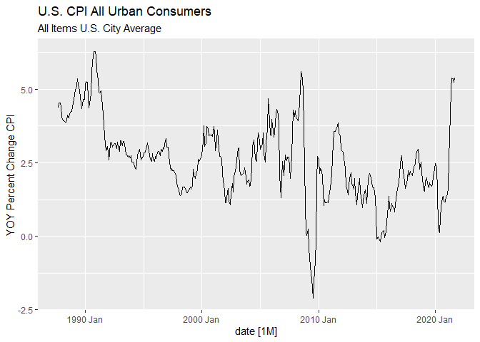
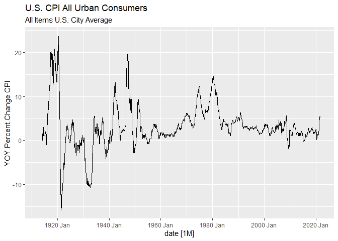
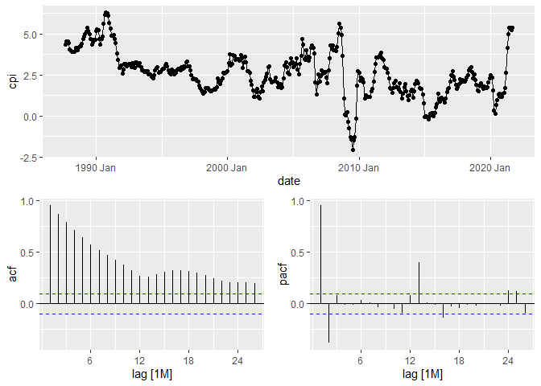
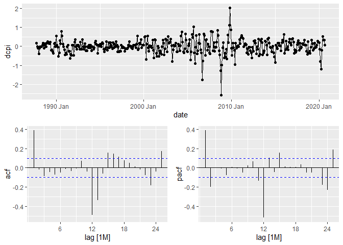
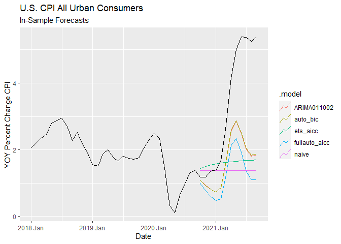
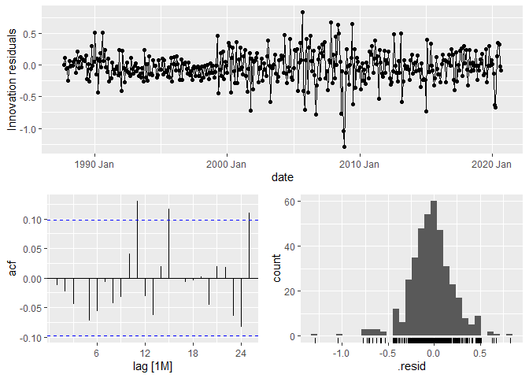
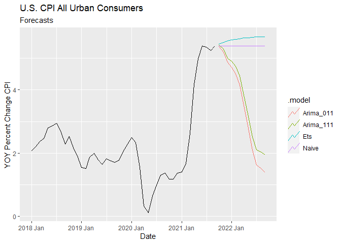

October 2021 Inflation Forecasting
================
Kyle Mouly
November 9, 2021

-   [Univariate Models](#univariate-models)
    -   [Data](#data)
        -   [Stationarity](#stationarity)
    -   [Model Selection](#model-selection)
    -   [Forecasts](#forecasts)

``` r
library(tidyverse)
library(fable)
library(fabletools)
library(tsibble)
library(fredr)
library(feasts)
library(lubridate)
```

# Univariate Models

## Data

``` r
CPI <- fredr(series_id = "CPIAUCNS",
             observation_start = as.Date("1987-09-25"),
             observation_end = as.Date("2021-09-25"),
             units = "pc1") %>%
  mutate(date = yearmonth(date)) %>%
  select(-c("realtime_start","realtime_end")) %>%
  rename(cpi = value) %>%
  as_tsibble(index = date)

CPI %>% autoplot(cpi)+ 
  labs(title = "U.S. CPI All Urban Consumers",
       subtitle = "All Items U.S. City Average",
       y = "YOY Percent Change CPI")
```

<!-- -->

The CPI data is segmented so as to start after September 1987 to account
for the change in the Federal Reserve’s attitude towards inflation
following Paul Volcker’s tenure as chair; a change which is clear when
long term inflation trends are examined.

``` r
fredr(series_id = "CPIAUCNS",
             observation_end = as.Date("2021-09-25"),
             units = "pc1") %>%
  mutate(date = yearmonth(date)) %>%
  select(-c("realtime_start","realtime_end")) %>%
  rename(cpi = value) %>%
  as_tsibble(index = date) %>%
  autoplot(cpi) +
  labs(title = "U.S. CPI All Urban Consumers",
       subtitle = "All Items U.S. City Average",
       y = "YOY Percent Change CPI")
```

    ## Warning: Removed 12 row(s) containing missing values (geom_path).

<!-- -->

The loss of data should not be concerning given that there remains over
30 years of monthly data for use in model training.

### Stationarity

The Plot does not indicate any obvious stationary, trending, seasonal
behavior; formal unit root tests will be necessary to determine what
transformations if any are necessary.

``` r
CPI %>%
  gg_tsdisplay(cpi,"partial")
```

<!-- -->

``` r
CPI %>%
  features(cpi,
           features = list(
             unitroot_kpss,
             unitroot_ndiffs,
             unitroot_nsdiffs))
```

    ## # A tibble: 1 x 4
    ##   kpss_stat kpss_pvalue ndiffs nsdiffs
    ##       <dbl>       <dbl>  <int>   <int>
    ## 1      2.16        0.01      1       0

``` r
CPI %>%
  mutate(dcpi = difference(cpi)) %>%
  features(dcpi, unitroot_kpss)
```

    ## # A tibble: 1 x 2
    ##   kpss_stat kpss_pvalue
    ##       <dbl>       <dbl>
    ## 1    0.0778         0.1

The ACF plot’s large number of significant lags suggests that the series
may be non-stationary which is confirmed by the KPSS test. The CPI
series is therefore integrated of order 1.

## Model Selection

``` r
CPI %>%
  slice(1:(n()-12)) %>%
  mutate(dcpi = difference(cpi)) %>%
  na.omit() %>%
  gg_tsdisplay(dcpi, plot_type = "partial")
```

<!-- -->

Looking at the ACF and PACF of the first differenced training set
suggests the candidate models of ARIMA(0,1,1) or ARIMA(2,1,0) with
seasonal components of either (2,0,0) or (0,0,2).

``` r
CPI_training.fit<- CPI %>%
  slice(1:(n()-12)) %>%
  model(ARIMA011002 = ARIMA(cpi ~ pdq(0,1,1) + PDQ(0,0,2)),
        ARIMA011200 = ARIMA(cpi ~ pdq(0,1,1) + PDQ(2,0,0)),
        ARIMA210002 = ARIMA(cpi ~ pdq(2,1,0) + PDQ(0,0,2)),
        ARIMA210200 = ARIMA(cpi ~ pdq(2,1,0) + PDQ(2,0,0)),
        auto_aicc = ARIMA(cpi, ic = "aicc"),
        fullauto_aicc = ARIMA(cpi, ic = "aicc", stepwise = FALSE, approximation = FALSE),
        auto_bic = ARIMA(cpi, ic = "bic"),
        fullauto_bic = ARIMA(cpi, ic = "bic", stepwise = FALSE, approximation = FALSE),
        ets_aicc = ETS(cpi, ic = "aicc"),
        ets_bic = ETS(cpi, ic = "bic"),
        naive = NAIVE(cpi)
  )
```

``` r
CPI_training.fit %>% pivot_longer(everything(), names_to = "Model", values_to = "Order")
```

    ## # A mable: 11 x 2
    ## # Key:     Model [11]
    ##    Model                                      Order
    ##    <chr>                                    <model>
    ##  1 ARIMA011002            <ARIMA(0,1,1)(0,0,2)[12]>
    ##  2 ARIMA011200            <ARIMA(0,1,1)(2,0,0)[12]>
    ##  3 ARIMA210002            <ARIMA(2,1,0)(0,0,2)[12]>
    ##  4 ARIMA210200            <ARIMA(2,1,0)(2,0,0)[12]>
    ##  5 auto_aicc              <ARIMA(1,1,2)(0,0,2)[12]>
    ##  6 fullauto_aicc <ARIMA(2,1,0)(2,0,1)[12] w/ drift>
    ##  7 auto_bic               <ARIMA(1,1,1)(0,0,2)[12]>
    ##  8 fullauto_bic           <ARIMA(0,1,1)(0,0,2)[12]>
    ##  9 ets_aicc                           <ETS(A,Ad,N)>
    ## 10 ets_bic                             <ETS(A,N,N)>
    ## 11 naive                                    <NAIVE>

``` r
CPI_training.fit %>% glance() %>% arrange(AICc) %>% select(.model:BIC)
```

    ## # A tibble: 11 x 6
    ##    .model        sigma2 log_lik    AIC   AICc    BIC
    ##    <chr>          <dbl>   <dbl>  <dbl>  <dbl>  <dbl>
    ##  1 fullauto_aicc 0.0593   -11.1   36.1   36.4   64.0
    ##  2 auto_bic      0.0607   -15.4   40.8   41.0   60.7
    ##  3 ARIMA210002   0.0608   -15.5   41.0   41.2   60.9
    ##  4 auto_aicc     0.0608   -15.0   42.1   42.3   66.0
    ##  5 ARIMA011002   0.0614   -17.2   42.5   42.6   58.4
    ##  6 fullauto_bic  0.0614   -17.2   42.5   42.6   58.4
    ##  7 ARIMA011200   0.0733   -46.9  102.   102.   118. 
    ##  8 ARIMA210200   0.0731   -46.0  102.   102.   122. 
    ##  9 ets_aicc      0.140   -796.  1603.  1603.  1627. 
    ## 10 ets_bic       0.145   -803.  1612.  1612.  1624. 
    ## 11 naive         0.145     NA     NA     NA     NA

``` r
CPI_training.fit %>%
  forecast(h = 12) %>%
  accuracy(CPI)%>%
  arrange(RMSE)
```

    ## # A tibble: 11 x 10
    ##    .model        .type    ME  RMSE   MAE   MPE  MAPE  MASE RMSSE  ACF1
    ##    <chr>         <chr> <dbl> <dbl> <dbl> <dbl> <dbl> <dbl> <dbl> <dbl>
    ##  1 auto_bic      Test   1.69  2.10  1.69  44.5  44.5  1.52  1.37 0.802
    ##  2 auto_aicc     Test   1.70  2.11  1.70  44.7  44.7  1.53  1.37 0.802
    ##  3 ARIMA011002   Test   1.70  2.12  1.70  44.4  44.4  1.53  1.38 0.802
    ##  4 fullauto_bic  Test   1.70  2.12  1.70  44.4  44.4  1.53  1.38 0.802
    ##  5 ARIMA210002   Test   1.73  2.13  1.73  45.9  45.9  1.55  1.39 0.801
    ##  6 ARIMA011200   Test   1.66  2.16  1.66  39.2  39.2  1.50  1.40 0.815
    ##  7 ARIMA210200   Test   1.70  2.19  1.70  40.7  40.7  1.53  1.42 0.815
    ##  8 ets_aicc      Test   1.72  2.46  1.88  30.7  43.2  1.69  1.60 0.839
    ##  9 fullauto_aicc Test   2.12  2.58  2.12  57.9  57.9  1.91  1.68 0.796
    ## 10 naive         Test   1.96  2.68  2.03  39.3  44.9  1.83  1.74 0.836
    ## 11 ets_bic       Test   1.96  2.68  2.03  39.3  44.9  1.83  1.74 0.836

The best model according to AICc is the ARIMA (2,1,0)(2,0,1) with drift
which was selected with the Hyndman-Khandakar algorithm without
approximation or stepwise selection. The best model according to BIC is
the ARIMA (0,1,1)(0,0,2) which was selected manually. According to the
accuracy measures of RMSE and MASE the best model seems to be the ARIMA
(1,1,1)(0,0,2). Given the ARIMA (2,1,0)(2,0,1) with dirft’s poor
performance in out of sample accuracy measures the best models seem to
be the ARIMA (1,1,1)(0,0,2) selected by the Hyndman-Khandakar algorithm
while minimizing BIC and without additional options and ARIMA
(0,1,1)(0,0,2) which was selected manually.

``` r
CPI_training.fit %>%
  select(auto_bic, fullauto_aicc, ARIMA011002, naive, ets_aicc) %>%
  forecast(h =12) %>%
  autoplot(filter(CPI, year(date) >= 2018), level = NULL) +
  labs(title = "U.S. CPI All Urban Consumers",
       subtitle = "In-Sample Forecasts",
       y = "YOY Percent Change CPI",
       x = "Date")
```

<!-- -->

The plotted in-sample forecasts show that the ARIMA models are much
better at predicting the large spike in CPI but are nevertheless far
from perfect, being overall outperformed slightly by simple one step
naive forecasts as indicated by their MASE of greater than 1, which is
not particularly surprising given the rather extreme conditions under
which these models are forecasting.

``` r
CPI_training.fit %>% augment %>% features(.innov, ljung_box)
```

    ## # A tibble: 11 x 3
    ##    .model           lb_stat lb_pvalue
    ##    <chr>              <dbl>     <dbl>
    ##  1 ARIMA011002    0.402      5.26e- 1
    ##  2 ARIMA011200    0.284      5.94e- 1
    ##  3 ARIMA210002    0.0459     8.30e- 1
    ##  4 ARIMA210200    0.0175     8.95e- 1
    ##  5 auto_aicc      0.0949     7.58e- 1
    ##  6 auto_bic       0.0660     7.97e- 1
    ##  7 ets_aicc      24.4        7.78e- 7
    ##  8 ets_bic       60.4        7.77e-15
    ##  9 fullauto_aicc  0.0000262  9.96e- 1
    ## 10 fullauto_bic   0.402      5.26e- 1
    ## 11 naive         60.2        8.55e-15

``` r
CPI_training.fit %>% select(auto_bic) %>% gg_tsresiduals()
```

<!-- -->

According to the Ljung-Box test we fail to reject the null hypothesis of
serially uncorrelated errors for all ARIMA models.

## Forecasts

``` r
CPI %>%
  model(Naive = NAIVE(cpi),
        Arima_111 = ARIMA(cpi ~ pdq(1,1,1) + PDQ(0,0,2)),
        Arima_011 = ARIMA(cpi ~ pdq(0,1,1) + PDQ(0,0,2)),
        Ets = ETS(cpi ~ error(method = "A") +
                    trend(method = "Ad") +
                    season(method = "N"))) %>%
  pivot_longer(everything(), names_to = "Model", values_to = "Order")
```

    ## # A mable: 4 x 2
    ## # Key:     Model [4]
    ##   Model                                  Order
    ##   <chr>                                <model>
    ## 1 Naive                                <NAIVE>
    ## 2 Arima_111          <ARIMA(1,1,1)(0,0,2)[12]>
    ## 3 Arima_011 <ARIMA(0,1,1)(0,0,2)[12] w/ drift>
    ## 4 Ets                            <ETS(A,Ad,N)>

``` r
CPI %>%
  model(Naive = NAIVE(cpi),
        Arima_111 = ARIMA(cpi ~ pdq(1,1,1) + PDQ(0,0,2)),
        Arima_011 = ARIMA(cpi ~ pdq(0,1,1) + PDQ(0,0,2)),
        Ets = ETS(cpi ~ error(method = "A") + trend(method = "Ad") + season(method = "N"))) %>%
  forecast(h = 12) %>%
  autoplot(filter(CPI, year(date) >= 2018), level = NULL) + 
  labs(title = "U.S. CPI All Urban Consumers",
       subtitle = "Forecasts",
       y = "YOY Percent Change CPI",
       x = "Date")
```

<!-- -->

``` r
CPI %>%
  model(Naive = NAIVE(cpi),
        Arima_111 = ARIMA(cpi ~ pdq(1,1,1) + PDQ(0,0,2)),
        Arima_011 = ARIMA(cpi ~ pdq(0,1,1) + PDQ(0,0,2)),
        Ets = ETS(cpi ~ error(method = "A") + trend(method = "Ad") + season(method = "N"))) %>%
  forecast(h = 1)
```

    ## # A fable: 4 x 4 [1M]
    ## # Key:     .model [4]
    ##   .model        date           cpi .mean
    ##   <chr>        <mth>        <dist> <dbl>
    ## 1 Naive     2021 Oct  N(5.4, 0.15)  5.39
    ## 2 Arima_111 2021 Oct N(5.4, 0.061)  5.42
    ## 3 Arima_011 2021 Oct N(5.4, 0.061)  5.38
    ## 4 Ets       2021 Oct  N(5.5, 0.14)  5.45

The one step forecast of the chosen ARIMA model return a predicted YOY
change in CPI of 5.42% for October while the simple one step naive
forecast returns a predicted YOY change in CPI of 5.39% for October.
