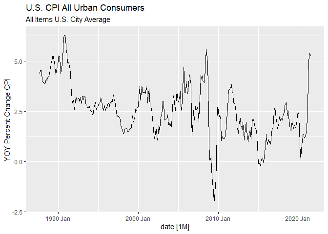
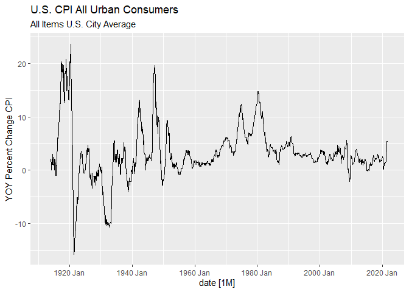
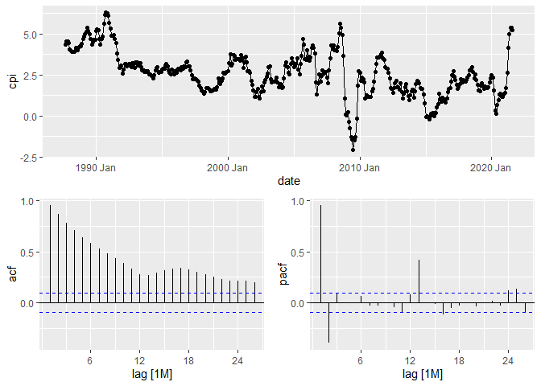
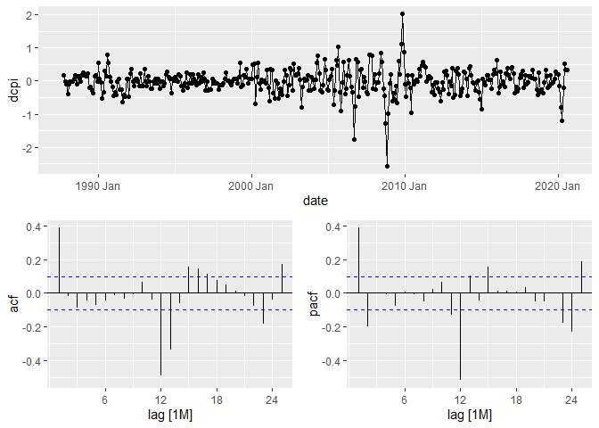
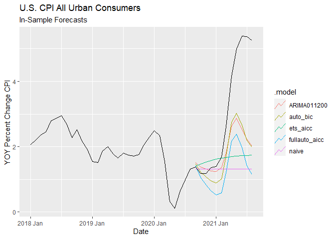
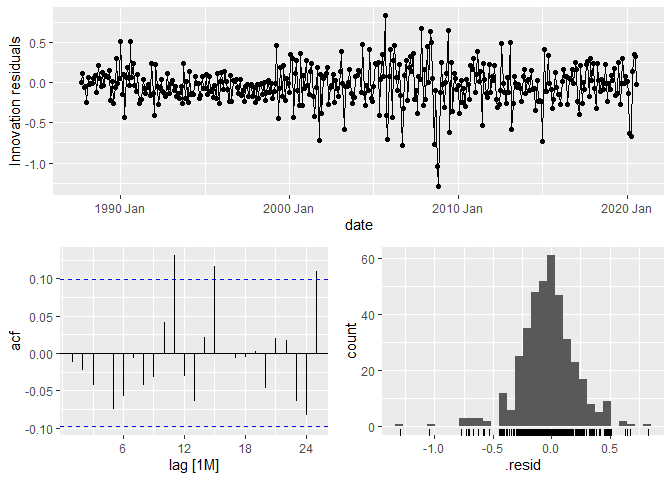
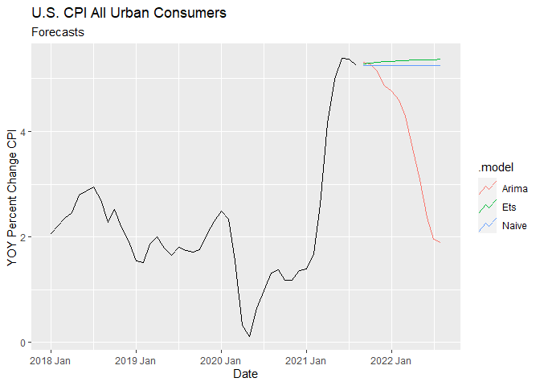

September 2021 Inflation Forecasting
================
Kyle Mouly
September 22, 2021

-   [Univariate Models](#univariate-models)
    -   [Data](#data)
        -   [Stationarity](#stationarity)
    -   [Model Selection](#model-selection)
    -   [Forecasts](#forecasts)
-   [Official Results](#official-results)

``` r
library(tidyverse)
library(fable)
library(fabletools)
library(tsibble)
library(fredr)
library(feasts)
library(lubridate)
```

# Univariate Models

## Data

``` r
CPI <- fredr(series_id = "CPIAUCNS",
             observation_start = as.Date("1987-09-25"),
             observation_end = as.Date("2021-08-25"),
             units = "pc1") %>%
  mutate(date = yearmonth(date)) %>%
  select(-c("realtime_start","realtime_end")) %>%
  rename(cpi = value) %>%
  as_tsibble(index = date)

CPI %>% autoplot(cpi)+ 
  labs(title = "U.S. CPI All Urban Consumers",
       subtitle = "All Items U.S. City Average",
       y = "YOY Percent Change CPI")
```

<!-- -->

The CPI data is segmented so as to start after September 1987 to account
for the change in the Federal Reserve’s attitude towards inflation
following Paul Volcker’s tenure as chair; a change which is clear when
long term inflation trends are examined.

``` r
fredr(series_id = "CPIAUCNS",
             observation_end = as.Date("2021-08-25"),
             units = "pc1") %>%
  mutate(date = yearmonth(date)) %>%
  select(-c("realtime_start","realtime_end")) %>%
  rename(cpi = value) %>%
  as_tsibble(index = date) %>%
  autoplot(cpi) +
  labs(title = "U.S. CPI All Urban Consumers",
       subtitle = "All Items U.S. City Average",
       y = "YOY Percent Change CPI")
```

    ## Warning: Removed 12 row(s) containing missing values (geom_path).

<!-- -->

The loss of data should not be concerning given that there remains over
30 years of monthly data for use in model training.

### Stationarity

The Plot does not indicate any obvious stationary, trending, seasonal
behavior; formal unit root tests will be necessary to determine what
transformations if any are necessary.

``` r
CPI %>%
  gg_tsdisplay(cpi,"partial")
```

<!-- -->

``` r
CPI %>%
  features(cpi,
           features = list(
             unitroot_kpss,
             unitroot_ndiffs,
             unitroot_nsdiffs))
```

    ## # A tibble: 1 x 4
    ##   kpss_stat kpss_pvalue ndiffs nsdiffs
    ##       <dbl>       <dbl>  <int>   <int>
    ## 1      2.24        0.01      1       0

``` r
CPI %>%
  mutate(dcpi = difference(cpi)) %>%
  features(dcpi, unitroot_kpss)
```

    ## # A tibble: 1 x 2
    ##   kpss_stat kpss_pvalue
    ##       <dbl>       <dbl>
    ## 1    0.0741         0.1

The ACF plot’s large number of significant lags suggests that the series
may be non-stationary which is confirmed by the KPSS test. The CPI
series is therefore integrated of order 1.

## Model Selection

``` r
CPI %>%
  slice(1:(n()-12)) %>%
  mutate(dcpi = difference(cpi)) %>%
  na.omit() %>%
  gg_tsdisplay(dcpi, plot_type = "partial")
```

<!-- -->

Looking at the ACF and PACF of the first differenced training set
suggests the candidate models of ARIMA(0,1,1) or ARIMA(2,1,0) with
seasonal components of either (2,0,0) or (0,0,2).

``` r
CPI_training.fit<- CPI %>%
  slice(1:(n()-12)) %>%
  model(ARIMA011002 = ARIMA(cpi ~ pdq(0,1,1) + PDQ(0,0,2)),
        ARIMA011200 = ARIMA(cpi ~ pdq(0,1,1) + PDQ(2,0,0)),
        ARIMA210002 = ARIMA(cpi ~ pdq(2,1,0) + PDQ(0,0,2)),
        ARIMA210200 = ARIMA(cpi ~ pdq(2,1,0) + PDQ(2,0,0)),
        auto_aicc = ARIMA(cpi, ic = "aicc"),
        fullauto_aicc = ARIMA(cpi, ic = "aicc", stepwise = FALSE, approximation = FALSE),
        auto_bic = ARIMA(cpi, ic = "bic"),
        fullauto_bic = ARIMA(cpi, ic = "bic", stepwise = FALSE, approximation = FALSE),
        ets_aicc = ETS(cpi, ic = "aicc"),
        ets_bic = ETS(cpi, ic = "bic"),
        naive = NAIVE(cpi)
  )
```

``` r
CPI_training.fit %>% pivot_longer(everything(), names_to = "Model", values_to = "Order")
```

    ## # A mable: 11 x 2
    ## # Key:     Model [11]
    ##    Model                                      Order
    ##    <chr>                                    <model>
    ##  1 ARIMA011002            <ARIMA(0,1,1)(0,0,2)[12]>
    ##  2 ARIMA011200            <ARIMA(0,1,1)(2,0,0)[12]>
    ##  3 ARIMA210002            <ARIMA(2,1,0)(0,0,2)[12]>
    ##  4 ARIMA210200            <ARIMA(2,1,0)(2,0,0)[12]>
    ##  5 auto_aicc              <ARIMA(1,1,2)(0,0,2)[12]>
    ##  6 fullauto_aicc <ARIMA(2,1,0)(2,0,1)[12] w/ drift>
    ##  7 auto_bic               <ARIMA(1,1,1)(0,0,2)[12]>
    ##  8 fullauto_bic           <ARIMA(0,1,1)(0,0,2)[12]>
    ##  9 ets_aicc                           <ETS(A,Ad,N)>
    ## 10 ets_bic                             <ETS(A,N,N)>
    ## 11 naive                                    <NAIVE>

``` r
CPI_training.fit %>% glance() %>% arrange(AICc) %>% select(.model:BIC)
```

    ## # A tibble: 11 x 6
    ##    .model        sigma2 log_lik    AIC   AICc    BIC
    ##    <chr>          <dbl>   <dbl>  <dbl>  <dbl>  <dbl>
    ##  1 fullauto_aicc 0.0595   -11.5   37.1   37.4   64.9
    ##  2 auto_bic      0.0609   -15.8   41.6   41.8   61.5
    ##  3 ARIMA210002   0.0609   -15.9   41.9   42.0   61.8
    ##  4 auto_aicc     0.0610   -15.5   42.9   43.2   66.8
    ##  5 ARIMA011002   0.0615   -17.7   43.4   43.5   59.3
    ##  6 fullauto_bic  0.0615   -17.7   43.4   43.5   59.3
    ##  7 ARIMA011200   0.0734   -47.2  102.   102.   118. 
    ##  8 ARIMA210200   0.0733   -46.3  103.   103.   123. 
    ##  9 ets_aicc      0.141   -794.  1599.  1599.  1623. 
    ## 10 ets_bic       0.145   -801.  1608.  1608.  1620. 
    ## 11 naive         0.145     NA     NA     NA     NA

``` r
CPI_training.fit %>%
  forecast(h = 12) %>%
  accuracy(CPI)%>%
  arrange(RMSE)
```

    ## # A tibble: 11 x 10
    ##    .model        .type    ME  RMSE   MAE   MPE  MAPE  MASE RMSSE  ACF1
    ##    <chr>         <chr> <dbl> <dbl> <dbl> <dbl> <dbl> <dbl> <dbl> <dbl>
    ##  1 auto_bic      Test   1.25  1.73  1.27  32.1  33.8  1.15  1.12 0.782
    ##  2 ARIMA011200   Test   1.15  1.73  1.23  23.3  30.0  1.10  1.13 0.807
    ##  3 auto_aicc     Test   1.27  1.75  1.29  33.0  34.4  1.16  1.14 0.782
    ##  4 ARIMA011002   Test   1.31  1.78  1.32  34.2  35.2  1.19  1.16 0.782
    ##  5 fullauto_bic  Test   1.31  1.78  1.32  34.2  35.2  1.19  1.16 0.782
    ##  6 ARIMA210002   Test   1.31  1.78  1.33  34.9  35.8  1.19  1.16 0.780
    ##  7 ARIMA210200   Test   1.21  1.78  1.27  26.1  30.9  1.14  1.16 0.806
    ##  8 ets_aicc      Test   1.37  2.18  1.55  23.0  37.9  1.40  1.42 0.846
    ##  9 fullauto_aicc Test   1.72  2.23  1.72  49.0  49.4  1.55  1.45 0.776
    ## 10 naive         Test   1.69  2.45  1.73  36.1  39.8  1.56  1.59 0.843
    ## 11 ets_bic       Test   1.69  2.45  1.73  36.1  39.8  1.56  1.59 0.843

Overall the best performing model according to a mix of information
criteria like AICc and BIC and accuracy measures like RMSE and MASE is
the model generated through the Hyndman-Khandakar algorithm for
automatic ARIMA modelling while minimizing BIC. The model specification
turns out to be an ARIMA(1,1,1)(0,0,2).

``` r
CPI_training.fit %>%
  select(auto_bic, fullauto_aicc, ARIMA011200, naive, ets_aicc) %>%
  forecast(h =12) %>%
  autoplot(filter(CPI, year(date) >= 2018), level = NULL) +
  labs(title = "U.S. CPI All Urban Consumers",
       subtitle = "In-Sample Forecasts",
       y = "YOY Percent Change CPI",
       x = "Date")
```

<!-- -->

The plotted in-sample forecasts show that the ARIMA models are much
better at predicting the large spike in CPI but are nevertheless far
from perfect, being overall outperformed slightly by simple one step
naive forecasts as indicated by their MASE of greater than 1.

``` r
CPI_training.fit %>% augment %>% features(.innov, ljung_box)
```

    ## # A tibble: 11 x 3
    ##    .model           lb_stat lb_pvalue
    ##    <chr>              <dbl>     <dbl>
    ##  1 ARIMA011002    0.409      5.23e- 1
    ##  2 ARIMA011200    0.296      5.87e- 1
    ##  3 ARIMA210002    0.0448     8.32e- 1
    ##  4 ARIMA210200    0.0182     8.93e- 1
    ##  5 auto_aicc      0.0927     7.61e- 1
    ##  6 auto_bic       0.0657     7.98e- 1
    ##  7 ets_aicc      24.9        6.12e- 7
    ##  8 ets_bic       60.1        8.88e-15
    ##  9 fullauto_aicc  0.0000320  9.95e- 1
    ## 10 fullauto_bic   0.409      5.23e- 1
    ## 11 naive         59.9        9.77e-15

``` r
CPI_training.fit %>% select(auto_bic) %>% gg_tsresiduals()
```

<!-- -->

## Forecasts

``` r
CPI %>%
  model(Naive = NAIVE(cpi),
        Arima = ARIMA(cpi ~ pdq(1,1,1) + PDQ(0,0,2)),
        Ets = ETS(cpi ~ error(method = "A") + trend(method = "Ad") + season(method = "N"))) %>%
  pivot_longer(everything(), names_to = "Model", values_to = "Order")
```

    ## # A mable: 3 x 2
    ## # Key:     Model [3]
    ##   Model                     Order
    ##   <chr>                   <model>
    ## 1 Naive                   <NAIVE>
    ## 2 Arima <ARIMA(1,1,1)(0,0,2)[12]>
    ## 3 Ets               <ETS(A,Ad,N)>

``` r
CPI %>%
  model(Naive = NAIVE(cpi),
        Arima = ARIMA(cpi ~ pdq(1,1,1) + PDQ(0,0,2)),
        Ets = ETS(cpi ~ error(method = "A") + trend(method = "Ad") + season(method = "N"))) %>%
  forecast(h = 12) %>%
  autoplot(filter(CPI, year(date) >= 2018), level = NULL) + 
  labs(title = "U.S. CPI All Urban Consumers",
       subtitle = "Forecasts",
       y = "YOY Percent Change CPI",
       x = "Date")
```

<!-- -->

``` r
CPI %>%
  model(Naive = NAIVE(cpi),
        Arima = ARIMA(cpi ~ pdq(1,1,1) + PDQ(0,0,2)),
        Ets = ETS(cpi ~ error(method = "A") + trend(method = "Ad") + season(method = "N"))) %>%
  forecast(h = 1)
```

    ## # A fable: 3 x 4 [1M]
    ## # Key:     .model [3]
    ##   .model     date           cpi .mean
    ##   <chr>     <mth>        <dist> <dbl>
    ## 1 Naive  2021 Sep  N(5.3, 0.15)  5.25
    ## 2 Arima  2021 Sep N(5.3, 0.061)  5.30
    ## 3 Ets    2021 Sep  N(5.3, 0.14)  5.28

The one step forecast of the chosen ARIMA model return a predicted YOY
change in CPI of 5.30% for September while the simple one step naive
forecast returns a predicted YOY change in CPI of 5.25% for September.

# Official Results

The Bureau of Labor Statistics released the official inflation measures
for the month of September 2021 on October 13, 2021 at 8:30am. Rounded
to 2 decimal places, official year over year inflation in August was
5.39% which is considerably higher than both the ARIMA model’s forecast
of 5.30% and the one step naive model’s forecast of 5.25%.
